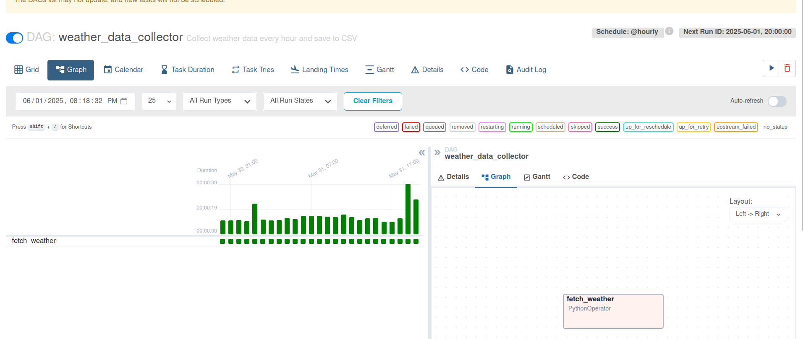
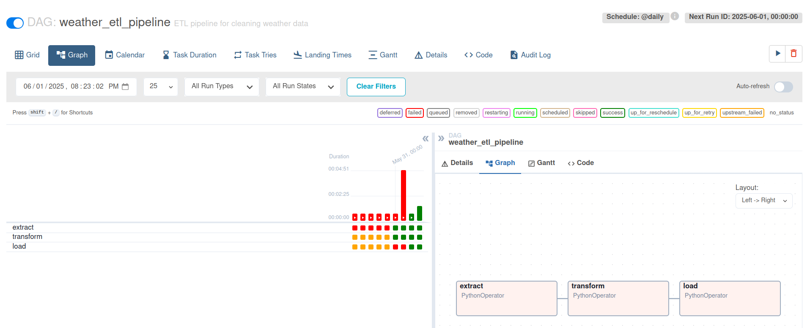
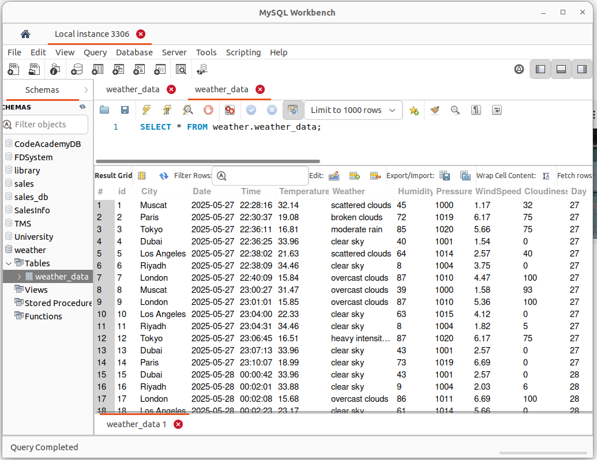
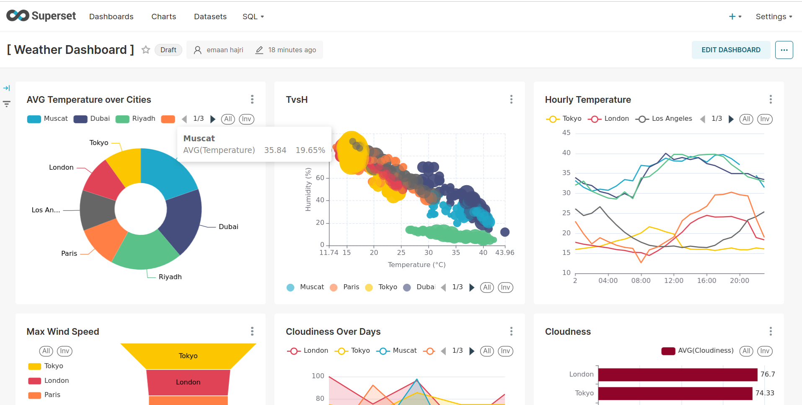
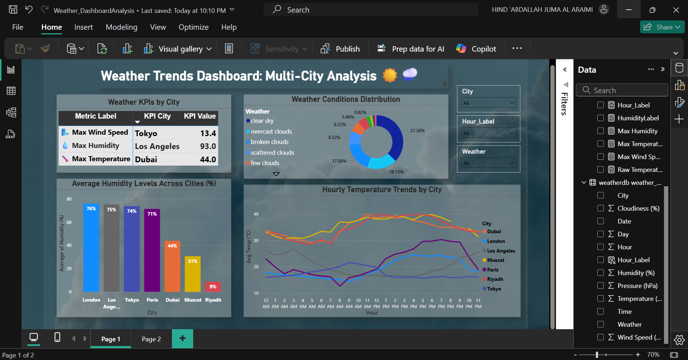

**Weather ETL Pipeline with Airflow, Python,**  
**MySQL & ( Power BI & Apache Superset )**

This project demonstrates a complete ELT (Extract, Load, Transform) pipeline for weather data collection, processing, and visualization using openWeatherMap API, Apache Airflow, Python, MySQL and - Power BI (Windows) & Apache Superset (Linux Ubuntu) -.

## Project Overview

Over the course of one week, We built an automated data pipeline to collect and analyze real-time weather data.  
Data was collected from an openWeatherMap API: https://openweathermap.org/ over 4 days for multiple cities :

and processed through the following stages:

- **Extraction** using  pythonOperator
- **Transformation** using pythonOperator and Pandas 
  

- **Loading** into a MySQL database  
  

- **Visualization** in Power BI and Apache Superset with dynamic dashboards
   * Apache Superset
  
  * Power BI : 
   
  
